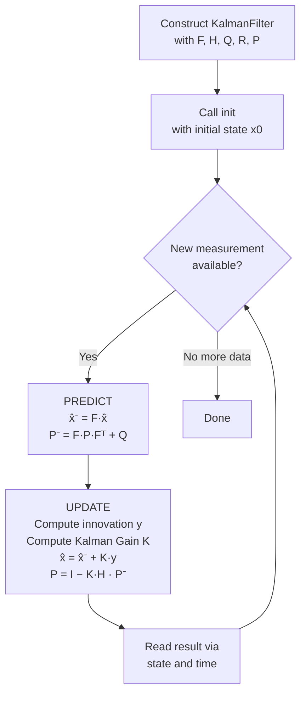

# Linear Kalman Filter in C++ (Eigen)

A clean, minimal, from-scratch implementation of a **discrete-time linear Kalman Filter** in modern C++, using the [Eigen](https://eigen.tuxfamily.org/) linear algebra library. Built as a hands-on learning project to understand state estimation theory by implementing it directly, rather than just using a library.

> This is the foundation of a broader learning path toward Extended (EKF) and Unscented (UKF) Kalman Filters for nonlinear systems.

---

## Table of Contents

- [Overview](#overview)
- [What Problem Does This Solve?](#what-problem-does-this-solve)
- [Theory Summary](#theory-summary)
- [How the Filter Works — Flowchart](#how-the-filter-works--flowchart)
- [Project Structure](#project-structure)
- [Class API](#class-api)
- [Example: Estimating a Falling Projectile](#example-estimating-a-falling-projectile)
- [Building the Project](#building-the-project)
- [Sample Output](#sample-output)
- [Tuning Notes (Q and R)](#tuning-notes-q-and-r)
- [Roadmap](#roadmap)
- [References](#references)
- [License](#license)

---

## Overview

This repository implements a general-purpose, **linear**, discrete-time Kalman Filter as a reusable C++ class (`KalmanFilter`). It is intentionally system-agnostic — the state dimension, measurement dimension, and dynamics are all supplied by the caller via matrices, so the same class can track anything from a falling object to a moving vehicle, as long as the system is linear.

The included example (`main.cpp`) demonstrates the filter tracking a **1D projectile in free fall**, estimating position, velocity, and acceleration from noisy position-only measurements.

## What Problem Does This Solve?

In any real system, you typically have two imperfect sources of information about the thing you're trying to track:

1. A **dynamics model** — a mathematical description of how the state *should* evolve over time (e.g., basic kinematics). This model is never perfectly accurate.
2. **Sensor measurements** — real-world readings of (some of) the state. These are always corrupted by noise.

The Kalman Filter fuses these two imperfect sources into a single estimate that is provably optimal (in the minimum mean-squared-error sense) for linear systems with Gaussian noise — smoother and more accurate than either the model or the raw sensor data alone.

## Theory Summary

At every discrete time step, the filter alternates between two phases:

**1. Predict** — project the state forward in time using the dynamics model, and grow the uncertainty to account for unmodeled disturbances.

**2. Update** — incorporate a new sensor measurement, weighting the correction by the relative confidence in the prediction versus the sensor (the **Kalman Gain**).

| Step | Equation | Meaning |
|---|---|---|
| State prediction | `x̂⁻ = F · x̂` | Project the state forward using the dynamics model |
| Covariance prediction | `P⁻ = F · P · Fᵀ + Q` | Uncertainty grows due to process noise |
| Innovation | `y = z − H · x̂⁻` | Gap between actual and expected measurement |
| Innovation covariance | `S = H · P⁻ · Hᵀ + R` | Total uncertainty in measurement space |
| Kalman Gain | `K = P⁻ · Hᵀ · S⁻¹` | Optimal blending weight between model and sensor |
| State update | `x̂ = x̂⁻ + K · y` | Correct the prediction using the measurement |
| Covariance update | `P = (I − K · H) · P⁻` | Uncertainty shrinks — we've gained information |

| Symbol | Meaning |
|---|---|
| `x̂` | State estimate vector |
| `P` | Estimate error covariance matrix |
| `F` | State transition (dynamics) matrix |
| `H` | Measurement (observation) matrix |
| `Q` | Process noise covariance |
| `R` | Measurement noise covariance |
| `K` | Kalman Gain |
| `z` | Measurement vector |

## How the Filter Works — Flowchart



Each call to `update()` performs one full predict-then-correct cycle — this is the entire algorithm, executed once per incoming measurement.

## Project Structure

```
.
├── include/
│   └── KalmanFilter.hpp    # Class declaration and documented member variables
├── src/
│   └── KalmanFilter.cpp    # Predict/update implementation
├── main.cpp                 # Example: 1D projectile tracking
└── README.md
```

## Class API

```cpp
// Construct a filter with the system's defining matrices
KalmanFilter(double dt,
             const Eigen::MatrixXd& F,   // state transition matrix
             const Eigen::MatrixXd& H,   // measurement matrix
             const Eigen::MatrixXd& Q,   // process noise covariance
             const Eigen::MatrixXd& R,   // measurement noise covariance
             const Eigen::MatrixXd& P);  // initial estimate covariance

// Initialize the filter's starting state
void init();                                     // start at zero
void init(double t0, const Eigen::VectorXd& x0);  // start at a specific guess

// Run one predict + update cycle for a new measurement
void update(const Eigen::VectorXd& z);
void update(const Eigen::VectorXd& z, double dt, const Eigen::MatrixXd& F); // with a changed dt / F

// Read the current estimate
Eigen::VectorXd state();
double time();
```

**Lifecycle:** construct → `init()` → repeatedly call `update()` as measurements arrive → read results via `state()`.

## Example: Estimating a Falling Projectile

`main.cpp` tracks a 1D projectile with:

- **State** `x = [position, velocity, acceleration]` — 3 states
- **Measurement** `z = [position]` — 1 measurement (velocity and acceleration are *inferred*, never directly measured)
- **Dynamics** `F` — a constant-acceleration kinematic model
- **Initial guess** — seeded with the first measurement, zero velocity, and `-9.81 m/s²` (gravity) for acceleration

Despite the sensor only ever reporting position, the filter recovers a smooth, physically consistent estimate of velocity and acceleration purely from how the noisy position measurements evolve over time.

## Building the Project

### Prerequisites

- A C++11 (or later) compiler
- [Eigen 3](https://eigen.tuxfamily.org/) (header-only — no linking required)

### Compile directly with g++

```bash
g++ -std=c++17 -I /path/to/eigen -I include src/KalmanFilter.cpp main.cpp -o kalman_demo
./kalman_demo
```

### Or with CMake

```cmake
cmake_minimum_required(VERSION 3.10)
project(KalmanFilterDemo)

set(CMAKE_CXX_STANDARD 17)
find_package(Eigen3 REQUIRED)

add_executable(kalman_demo main.cpp src/KalmanFilter.cpp)
target_include_directories(kalman_demo PRIVATE include)
target_link_libraries(kalman_demo Eigen3::Eigen)
```

```bash
mkdir build && cd build
cmake ..
make
./kalman_demo
```

## Sample Output

```
t = 0, x_hat[0]: 1.042 0 -9.81
t = 0.0333, z[0] = 1.107, x_hat[0] = 1.086 1.53 -8.92
t = 0.0667, z[1] = 1.291, x_hat[1] = 1.221 2.74 -7.65
...
```

Each line shows the incoming noisy measurement alongside the filter's smoothed, physically consistent state estimate.

## Tuning Notes (Q and R)

- **R** (measurement noise) should reflect real sensor characteristics — from a datasheet, or empirically from the variance of stationary sensor readings.
- **Q** (process noise) is more subjective — it represents how much you trust your dynamics model. Increase `Q` if the filter lags behind real changes in the system; decrease it if the output is too jittery or over-reacts to sensor noise.
- If `Q` is set to zero and the model is imperfect, the covariance `P` will shrink toward zero over time and the filter will become overconfident, effectively ignoring new measurements.

## Roadmap

- [x] Linear Kalman Filter (this repo)
- [ ] Extended Kalman Filter (EKF) for nonlinear systems, via Jacobian linearization
- [ ] Unscented Kalman Filter (UKF), via the unscented transform / sigma points
- [ ] Unit tests and CI
- [ ] Additional example systems (2D vehicle tracking, sensor fusion)

## References

- Welch, G. & Bishop, G. — [*An Introduction to the Kalman Filter*](https://www.cs.unc.edu/~welch/media/pdf/kalman_intro.pdf), UNC Chapel Hill.
- [Eigen documentation](https://eigen.tuxfamily.org/dox/)

## Reach out for visualization and simulation codes.


